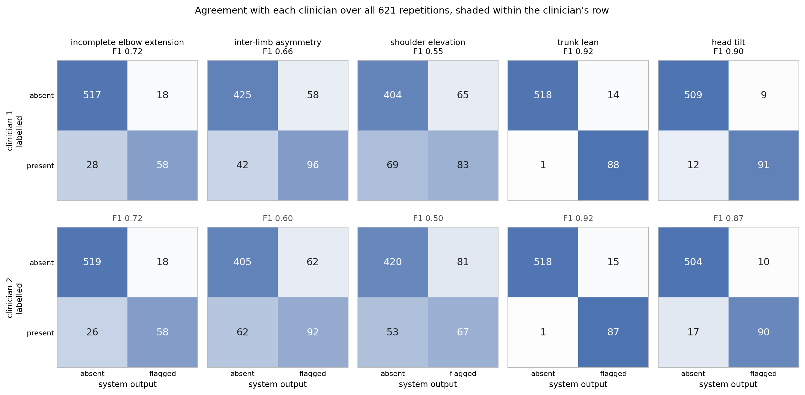

# Markerless detection of compensatory movement — validation data and analysis code

[](https://doi.org/10.5281/zenodo.21747009)
[](LICENSE)
[](LICENSE-DATA)

Repetition-level data, clinician annotations and analysis code behind the paper

> **Markerless On-Device Detection of Compensatory Movement Patterns in
> Upper-Limb Rehabilitation Exercises from Monocular RGB Video: A Validation
> Study in Healthy Adults**

The paper evaluates a browser-based pipeline that estimates body pose from a
single RGB camera and flags five compensatory movement patterns during a seated
lateral arm-raise exercise. This repository holds everything needed to
recompute the reported results, and a script that checks each number against
the value printed in the paper.

Every headline figure in the manuscript is reproduced by:

```bash
python3 code/reproduce.py
```

No dependencies beyond the Python standard library; Python 3.8 or newer. The
run takes about ten seconds and ends with either `All values match the
manuscript.` or a list of the values that did not.

## What is here

```
data/
  repetitions.csv        913 repetitions: system output plus the per-repetition
                         quantities it is derived from (621 detection, 292 calibration)
  annotations.csv        1242 labels: two clinicians x 621 repetitions
  consensus.csv          which repetitions the clinicians fully agreed on
  participants.csv       cohort membership and repetition counts
  thresholds.csv         the calibrated operating points and the timing rule
  DATA_DICTIONARY.md     every column, its units and its meaning
code/
  reproduce.py           recomputes the reported numbers and verifies them
  figure_elbow.py        the elbow criterion behind Figure 4 of the paper
  figure_spread.py       how unevenly the detector performs
  figure_confusion.py    agreement with each clinician, class by class
  extract_repetition_tables.py
                         how data/ was derived from the raw recordings
figures/
  elbow_threshold.*      the rendered figures, vector (PDF) and raster (PNG)
  spread.*
  confusion.*
docs/
  protocol.md            recording protocol
  annotation_guide.md    what the clinicians were asked to do
  privacy.md             what is published, what is withheld, and why
```

## What is not here, and why

**The video recordings.** They are identifiable video of participants. The
consent obtained covers research use and publication of anonymised results; it
does not cover public release of the recordings themselves. They remain on a
restricted laboratory server under pseudonymous codes.

**The per-frame keypoint series.** Derived skeletal coordinates are health data
and, as continuous per-person kinematics, are not equivalent to the aggregated
results the consent contemplates. They are available from the corresponding
author on request, for research use.

This is why the tables are at the repetition level. That granularity is not a
compromise on reproducibility: the per-repetition *sustained values* published
here are a sufficient statistic for the 250 ms decision rule, so the detector's
output can be recovered at any threshold. `reproduce.py` verifies that identity
against the published flags on all 621 detection repetitions, with no
disagreements. See "Sustained values" in the data dictionary.

**The inertial recordings** behind the angular-validation study, which was
carried out earlier and separately, are no longer retained. The agreement
statistics in the paper are those obtained in that analysis and cannot be
recomputed here. The paper states this and treats the affected analyses as
limitations rather than results.

## The study in brief

Twenty-seven healthy adults, in three non-overlapping cohorts: 9 for threshold
calibration, 18 for detection validation, and 10 in the earlier angular study.
Seated, each participant performed a lateral arm raise under six instructed
conditions — once correctly, and once for each of the five compensations. A
clinician instructed and physically demonstrated each condition; condition
order was randomised; co-occurring compensations were permitted rather than
suppressed.

Two clinicians then annotated every repetition independently, blind to the
instructed condition, and marked **every** compensation they could see, not
just the instructed one. That is why a repetition instructed to be
compensation-free may carry a label, and why a flag raised outside the
instructed condition is not automatically a false positive.

Thresholds were fixed on the 9-participant calibration cohort by Youden's index
subject to a false-positive rate no higher than 10%, then frozen before the
18-participant detection cohort was scored. No threshold was tuned on the data
it was evaluated on.

## Results this repository reproduces

Scored against each clinician over all 621 repetitions — the primary analysis:

| Compensation | F1 vs R1 | F1 vs R2 | Maturity as stated in the paper |
|---|---|---|---|
| Trunk lean | 0.92 | 0.92 | near-expert |
| Head tilt | 0.90 | 0.87 | near-expert |
| Incomplete elbow extension | 0.72 | 0.73 | moderate |
| Inter-limb asymmetry | 0.66 | 0.60 | moderate |
| Shoulder elevation | 0.55 | 0.50 | research-grade, not recommended for deployment |
| **macro-F1** | **0.75** | **0.72** | |

Scoring instead on the 477 repetitions the clinicians fully agreed on gives
macro-F1 0.78. That is the favourable reading, and the paper reports it as an
upper bound rather than as the result.

The macro-average deliberately mixes signs of different maturity and should not
be read as a single deployable-performance figure. Per-participant macro-F1
ranges from 0.38 to 0.96 (median 0.75).

`reproduce.py` additionally verifies the per-class confusion matrices against
both clinicians, the shoulder-elevation false-positive rate, the elbow
criterion behind Figure 4 (median minimum elbow angle 142° on elbow-flexion
repetitions against 166° on those instructed correct, area under the ROC curve
0.92, sensitivity 0.70 at specificity 0.95 at the operating point), the
calibration cohort's discrimination, and the participant-clustered bootstrap
intervals.

## The elbow criterion


Figure 4 of the paper, rendered from `data/repetitions.csv` alone. The left
panel shows the minimum elbow angle reached in each repetition, per
participant, split by instructed condition; the right panel the ROC curve with
the calibrated operating point marked. The overlap either side of the dashed
line is the point: the threshold sits on a narrow distribution in healthy
participants, which is what makes its placement — not the metric's
discrimination — the fragile part.

## What the macro-average hides


The same result, disaggregated. On the left, one macro-F1 per participant: the
median is 0.75, but individual participants run from 0.38 to 0.96, so a single
headline number describes no particular person well. On the right, one F1 per
sign against each clinician, which is the evidence behind the paper's three
tiers — trunk lean and head tilt near-expert, elbow extension and inter-limb
asymmetry moderate, shoulder elevation research-grade and not recommended for
deployment. Averaging across signs of such different maturity is exactly what
the paper warns against reading as a deployable-performance figure.

## Where the errors fall



Full counts behind every F1 above, shaded within the clinician's row so the
shading reads as recall and specificity rather than being swamped by the true
negatives. Trunk lean misses one positive out of 89 against either clinician;
shoulder elevation produces 65 and 81 false positives, which is the failure the
paper attributes to a structural confound with normal abduction rather than to
threshold placement.

## Regenerating the figures

The rendered files are committed under `figures/` in both PDF and PNG, so
nothing needs to be run to see them. To rebuild:

```bash
python3 -m pip install matplotlib
python3 code/figure_elbow.py
python3 code/figure_spread.py
python3 code/figure_confusion.py
```

Each script draws from `data/` alone and imports its scoring from
`reproduce.py`, so no figure can drift away from the verified numbers.

## Provenance

`code/extract_repetition_tables.py` is the script that produced `data/` from
the raw archive. It is published so the derivation can be audited, though it
cannot be run without the raw keypoint recordings. It carries the full geometry:
the isotropic coordinate convention, the resting-baseline definition, the gating
rules, and the 250 ms accumulation.

One detail worth flagging, since it is visible in the output. Coordinates from
the pose estimator are normalised per axis (`x = px/W`, `y = px/H`), which on a
16:9 frame scales the axes differently and does not preserve in-plane angles.
All geometry here therefore rescales `x` by `W/H` first. This correction was
made during peer review, and every number in this repository is post-correction.

## Ethics and privacy

Participation was documented on the institutional informed-consent form for
research participation of the Federal Center of Brain Research and
Neurotechnologies (FMBA of Russia), approved by order No. 117 of 1 June 2020.
Personal data, including video as biometric personal data, were processed under
Federal Law No. 152-FZ of 27 July 2006. Under the applicable institutional
requirements, studies of this type in healthy volunteers without medical
intervention do not require separate ethics-committee review. Participants gave
separate consent for video recording, for processing of video as biometric
personal data, and for use of anonymised results in publications, and retain
the right to withdraw consent and request deletion.

Identifiers in this repository are pseudonymous codes; the key linking them to
individuals is held separately by the responsible investigator and is not part
of this release. See `docs/privacy.md`.

## Limitations you should read before reusing this

- Healthy volunteers simulating compensations on instruction. Reduced range of
  motion, spasticity, pathological synergies and variable speed are absent, and
  the strongest metrics are the large-amplitude gestures that are easiest to
  exaggerate — so their agreement is the most likely to fall on real, subtler
  compensations.
- A single exercise. Segmentation, thresholds and metric quality do not
  transfer to upper-limb rehabilitation in general.
- One camera configuration. Height, distance, viewing angle and lighting were
  not varied, so device independence is not established empirically.
- The segmentation state machine was never validated against an independent
  reference, so repetition-count accuracy and phase-boundary error are unknown.
- The aggregate quality score reported in the paper is an unvalidated,
  equally-weighted summary and is not included here as an outcome.
- Anthropometry and handedness were not recorded, so the claim that the metrics
  limit dependence on body size follows from their construction and is not
  tested on these data.

## Licence

Code in `code/` is released under the MIT Licence (`LICENSE`).
Data in `data/` are released under CC BY 4.0 (`LICENSE-DATA`).

Attribution is required for the data. If you use them, cite the paper.

## Citation

Please cite the paper. The archive itself carries two DOIs:

* `10.5281/zenodo.21747009` — all versions; resolves to the latest. Cite this
  one unless you need to pin an exact version.
* `10.5281/zenodo.21747010` — version 1.0.0 specifically.

Author and affiliation metadata is in `CITATION.cff`.

## Contact

Corresponding author: a.e.pavlikov@mtuci.ru

Requests for the per-frame keypoint recordings, for research use, go to the
same address.
